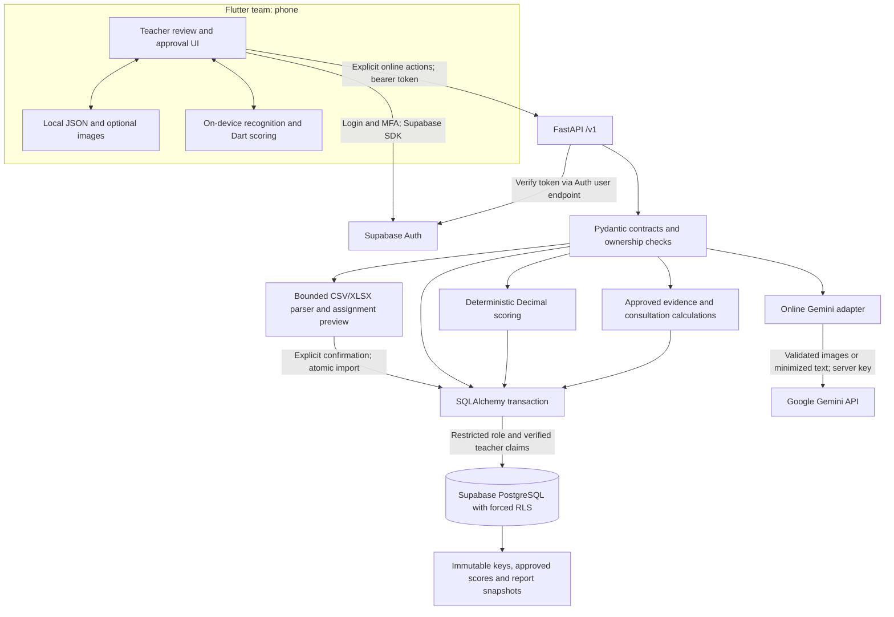

# Backend architecture

The phone's offline path stays entirely within its boundary. FastAPI, Auth, PostgreSQL and Gemini all require a network connection. Backend tests cover contracts and Python behavior, not Android recognition.

## Trust boundaries

- Supabase owns passwords, MFA, email verification, recovery and token issuance. FastAPI validates each bearer token against the configured project's Auth server. It reads claims only after that successful validation.
- Every protected database transaction derives `owner_id` from the verified identity. Composite foreign keys prevent cross-owner references. Production runs with `teachease_login`, switches transaction-locally to `teachease_api`, and sets verified claims for `auth.uid()` RLS. No service-role bypass is used.
- Supabase `anon` and `authenticated` roles have no direct access to backend tables. Frontend clients cannot write a forged approved grade through PostgREST. All grade mutations go through FastAPI.
- External Gemini content is validated as data, never executed. Document instructions cannot grant authority. Schemas, prompts and teacher approval together reduce extraction mistakes; none makes OCR infallible.
- AI rate counters commit in independent transactions and are shared across instances. Provider failures still consume the rate limit.

## Data and transactions

`assessment → answer_key_versions → assessment_questions → question_competencies` preserves keys, point values, accepted alternatives and competency labels. `submission → submission_answers + item_results + score_adjustments` explains each score. Approval stores actor/time. Offline upload stores all these records and its fingerprint receipt in one transaction; PostgreSQL advisory locks serialize retries for the same UUID.

`academic_year → term`, `grade_level → section → enrollment → student` capture class history. Sections belong to an academic year; enrollments are dated and cannot overlap. Assessment subject/term/date are immutable. A submission can be linked to a historical enrollment even after initial unassigned scanning.

Consultation snapshots preserve numerical evidence and enrollment labels. Reports use only approved results and choose the latest approved attempt per assessment. AI-generated summaries are optional, separately editable/reviewed, and retain their original draft and provenance.

Images are not persisted. The multipart body is bounded before parsing; decoded type, dimensions, frame count and content are checked. Re-encoding removes metadata. Future retained images must use a private bucket with teacher ownership policies and retention controls; database image blobs are not part of the design.
