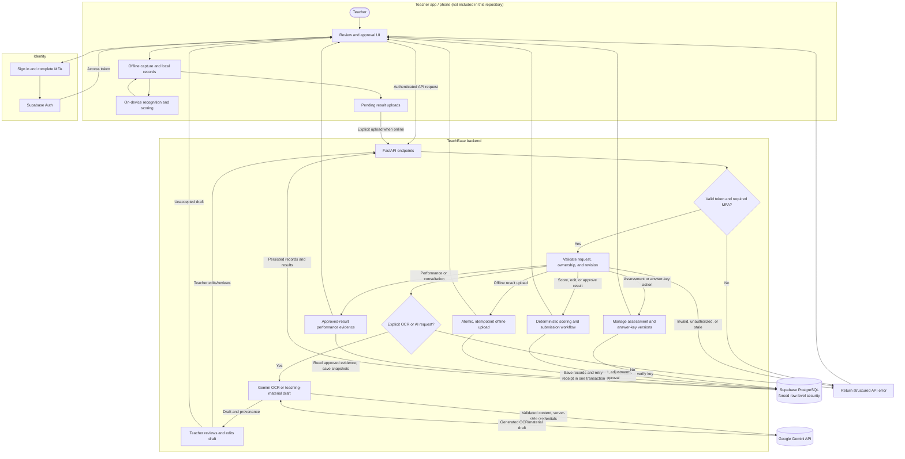

# TeachEase system flowchart

## Important boundaries

- Offline capture, local storage, and device-side recognition/scoring belong to a companion app; they are not implemented in this backend repository.
- The phone uses Supabase Auth for login. The backend verifies the access token and enforces teacher ownership on protected API requests.
- Objective answer scoring is deterministic. Gemini output is only a draft and requires teacher review; it does not approve grades.
- Uploaded result records do not include paper images. Images are sent to Gemini only for an explicit online OCR request and are not retained by this release.
- The database uses PostgreSQL row-level security in production. Local development can use SQLite.
